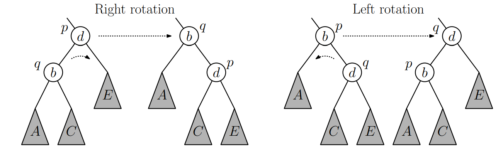
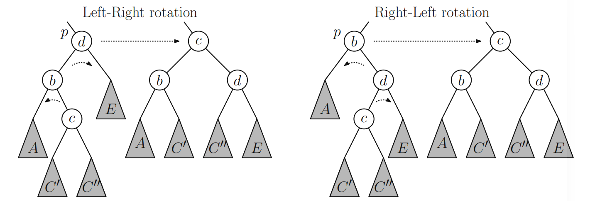

# Алгоритмы, решающие задачу RSQ

## 1. Наивное решение

#### Запрос суммы
Простое суммирование элементов на заданном диапазоне

#### Запрос присваивания
Простое присваивание нового значения элементу массиву 

#### Сложность решения:

* Пространственная: $\mathcal{O}(n)$

* Временная:

    * Запрос суммы: $\mathcal{O}(r - l + 1)$
    * Запрос присваивания: $\mathcal{O}(1)$


## 2-3. Дерево отрезков

Дерево отрезков - структура данных. Оно строится на массиве: каждой вершине ДО соответсвует некоторый отрезок (или полуинтервал) массива. Корню дерева соотвествует $[0; n)$, а каждая вершина (не считая листьев) имеет ровно двух сыновей.

Высота дерева отрезков $\Theta(\log n)$, так как на каждом уровне длина отрезка уменьшается вдвое. В это же время любой полуинтвервал разбивается на $\mathcal{O}(\log n)$ полуинтервалов, за которые отвечают вершины ДО.

### 2. Реализация сверху

Реализуется на полуинтервалах.

#### Построение

Достаточно выделить массив размером $4n$, где $n$ - размер массива, по которому строим ДО.

1. Строим ДО рекурсивно
2. В листе ДО ($l + 1 == r$) храним $l$-й элемент массива
3. В остальных вершинах храним сумму значений в детях

#### Запрос суммы

1. Если находимся в вершине, которой соотвествует полуинтвервал, не пересекающийся с полуинтервалом из запроса, то возвращаем 0

2. Если находимся в вершине, которой соотвествует полуинтвервал, полностью лежащий в полуинтервале из запроса, то возвращам значение в вершине

3. Иначе запускаемся рекурсивно от детей, возвращаем сумму

Временная сложность - количество полуинтервалов, на которые разобьется желаемый полуинтервал

#### Запрос присваивания

1. Если находимся в листе, то меняем значение в вершине

2. Иначе смотрим, в каком из детей вершины лежит изменяемый индекс, запускаемся рекурсивно от этого ребенка

3. Обновляем значение, лежащее в вершине, суммой значений в детях

Временная сложность - глубина дерева

#### Сложность решения

* Пространственная: $\mathcal{O}(n)$

* Временная:

    * Построение: $\mathcal{O}(n)$
    * Запрос суммы: $\mathcal{O}(\log n)$
    * Запрос присваивания: $\mathcal{O}(\log n)$

### 3. Реализация снизу

Реализуется на отрезках.

#### Построение

Достаточно выделить массив размеров $2n$, где $n$ - размер массива, по которому строим ДО.

1. Заполняем значения $t[i + n]$ (листья) соответствующими значения массива

2. Каждому из значений $t[i]$ для $i = (n-1)...0$ присваиваем $t[2 * i] + t[2 * i + 1]$

#### Запрос суммы

1. Сперва спустимся к листьям: $l += n;\, r += n$

2. Вершины кроме, возможно, крайних, разбиваются на пары (общий отец)

3. Отрежем вершины без пары – нечётный $l$ и чётный $r$, перейдём к отрезку отцов $[l/2,
r/2]$

#### Запрос присваивания

1. Обновляем значение в листе

2. Пересчитали значения во всех ячейках на пути до корня (все отрезки, содержащие индекс, в котором меняем значение)

#### Сложность решения

* Пространственная: $\mathcal{O}(n)$

* Временная:

    * Построение: $\mathcal{O}(n)$
    * Запрос суммы: $\mathcal{O}(\log(r - l + 1))$
    * Запрос присваивания: $\mathcal{O}(\log n)$

## 4. Дерево Фенвика

Для построения дерева Фенвика требуется массив $ t $, размер которого равен $ n $, где $ n $ — размер исходного массива $ a $. Элементы массива $ t $ определяются как:

$t[i] = \sum_{k=F(i)}^i a[k]$

где функция $ F(i) $ выбирается так, чтобы для каждого индекса $ i $ выполнялось неравенство $ F(i) \leq i $. 

### Построение

Для построения можно заполнить массив $t$ нулями и $n$ раз вызвать присваивние или префиксными суммами посчитать массив $t$

### Запрос суммы

Запрос суммы на отрезке $ [l; r] $ может быть выполнен с помощью следующей формулы:

$\text{sum}(l, r) = \text{sum}(r) - \text{sum}(l-1)$

где функция суммирования для префикса определяется как:

$\text{sum}(k) = t[k] + \text{sum}(F(k)-1)$

Таким образом, для получения суммы на заданном диапазоне необходимо выполнить несколько операций сложения по элементам массива $ t $

### Запрос присваивания

Для обновления значения элемента массива $ a[k] $ на величину $ delta $, необходимо обновить все элементы массива $ t $, которые зависят от измененного элемента, а именно те $ t[i] $, где $ F(i)\leq k \leq i $

При достаточно хорошей F найти все такие i достаточно легко

### Сложность решения

* **Пространственная сложность**: $\mathcal{O}(n)$
* **Временная сложность**:
    * Построение: $\mathcal{O}(n)$
    * Запрос суммы и присваивания: зависят от функции F

### Варианты функции F


  - $ F(i) = i \& (i+1)$
  - $ F(i) = i - (i \& -i) + 1$

  дают $\mathcal{O}(\log n)$ на сумму и присваивние
  
## 5. Корневая декомпозиция

#### Построение

1. Разделим массив на блоки размером по $c \approx \sqrt{n}$ элементов в каждом и посчитаем сумму на каждом блоке. Заметим, что блоков получилось $approx \sqrt{n}$

#### Запрос суммы

1. Запрашиваемый отрезок состоит из не более чем $\sqrt{n}$ полных блоков. Для всех таких блоков прибавим к ответу предподсчитанную сумму элементов в блоке

2. Запрашиваемый отрезок пересекается частично с не более чем двумя блоками. Посчитаем сумму элементов этих блоков, которые попали в запрашиваемый отрезок, прибавим к ответу

#### Запрос присваивания

1. Изменим значение элемента в массиве

2. Пересчитаем сумму элементов в соответсвующем блоке (вычитаем предыдущее значение и прибавляем новое)

#### Сложность решения

* Пространственная: $\mathcal{O}(n)$

* Временная:

    * Построение: $\mathcal{O}(n)$
    * Запрос суммы: $\mathcal{O}(\sqrt{n})$
    * Запрос присваивания: $\mathcal{O}(1)$


## 6-8. Решения, использующие деревья поиска по неявному ключу

BST – binary search tree (бинарное дерево поиска). В каждой вершине пара $(x, data)$.
Левое поддерево содержит пары $(x, data)$ со строго меньшими $x$. Правое поддерево содержит пары $(x, data)$ со строго большими $x$.

Обычно ключи задают на множестве порядок, и все запросы к BST как-то привязаны к этому порядку. Неявный ключ нужен, чтобы изобрести массив с вставкой в середину, удалением из середины и стандартным обращением в ячейку. **Решение такое**: выкинем ключи, а вместо них будем поддерживать информацию, которая поможет неявно восстановить ключ, когда он нам будет нужен, а именно - размер поддерева вершины. Тогда ключ (позицию элемента) можно восстановить как число элементов, которые находятся слева от него — что можно пересчитывать во время спуска по дереву.

$split(t, x)$ делит $t$ на $l: {a: a < x}$ и $r = {a \geq x}$. Соответсвенно, в неявном ключе - по размеру делит на префикс и суффикс массива.

Если все ключи в $l$ меньше, чем в $r$, то $merge(l, r)$ - BST, полученное объединением ключей $l$ и $r$. В случае неявного ключа - соединение массивов.

### 6. Декартово дерево

Декартово дерево от множества пар $(x_i, y_i)$ – структура, являющаяся BST по $x$ и кучей с минимумом в корне по $y$.

Декартово дерево (treap) от множества ключей $x_i$ – декартово дерево пар $(x_i, random)$

Соответсвенно, в ДД по неявному ключу поддерживаем пары $(size, random)$.

#### split

1. База индукции - если пришли в вершину NULL

2. Иначе, если размер левого сына + 1 (текущая вершина) не больше $k$, то текущая вершина и левый ребенок попадет в левое дерево, рекурсивно делим правого ребенка

3. Иначе рекурсивно делим левого ребенка

#### merge

1. База индукции - если $l$ NULL, возвращаем NULL, если $r$ NULL, то $l$

2. Если приоритет корня $l$ меньше, то корень $l$ - корень смердженного дерева, левый ребенок $l$ - левый ребенок результата, а правый - нужно смерджить правого ребенка $l$ и $r$, то есть рекурсивно запустим $l \rightarrow r = merge(l \rightarrow r, r)$

3. Иначе корень $r$ - корень смердженного дерева, правый ребенок $r$ - правый ребенок результата, а левый - нужно смерджить левого ребенка $r$ и $l$, то есть рекурсивно запустим $r \rightarrow l = merge(l, r \rightarrow l)$

#### Построение

Будем делать последовательный Add элементов массива. $Add = split + merge + merge$. Поддерживаем в вершине дополнительную информация - сумму элементов в поддереве

#### Запрос суммы

1. Делаем split нужного отрезка (2 split префикса), получаем три поддерева (префикс, наш отрезок, суффикс)

2. Берем сумму в корне получившегося дерева

3. Мерджим префикс, наш отрезок и суффикс

#### Запрос присваивания

Нужно удалить старый элемент массива и добавить новый, то есть Del(i) + Add(i, x)

$Del = split + split + merge$

#### Сложность решения

* Пространственная: $\mathcal{O}(n)$

* Временная:

    * Построение: $\mathcal{O}(n \log n)$
    * Запрос суммы: $\mathcal{O}(\log n)$
    * Запрос присваивания: $\mathcal{O}(\log n)$


### 7. AVL-дерево

AVL-дерево – это BST, у которого поддерживается инвариант, что разница высот левого и
правого поддерева для каждой вершины не превосходит 1.

#### Вставка

1. **Стандартная вставка**: Выполняется как в обычном BST. Новый элемент добавляется в соответствующее место по правилам бинарного дерева поиска.
2. **Проверка на балансировку**: Для каждого предка проверяется балансировка. Если разность высот больше 1, выполняется одно из следующих вращений:
   - **LL-вращение**: Если левое поддерево левого ребенка нарушает баланс.
   - **RR-вращение**: Если правое поддерево правого ребенка нарушает баланс.

 
 
   - **LR-вращение**: Если правое поддерево левого ребенка нарушает баланс (сначала выполняется LL, затем RR).
   - **RL-вращение**: Если левое поддерево правого ребенка нарушает баланс (сначала выполняется RR, затем LL).



```plaintext

	AvlNode rotateRight(AvlNode p){ // right single rotation
		AvlNode q = p.left;
		p.left = q.right; // swap inner child
		q.right = p; // bring q above p
		TODO // update heights
		return q; // q replaces p
	}

	AvlNode rotateLeft(AvlNode p) { ... symmetrical to rotateRight ... }

	AvlNode rotateLeftRight(AvlNode p){ // left-right double rotation
		p.left = rotateLeft(p.left);
		return rotateRight(p);
	}

	AvlNode rotateRightLeft(AvlNode p) { ... symmetrical to rotateLeftRight ... }

	AvlNode rebalance(AvlNode p) {
		balance = p.right.left - p.left.right
		if (balance > +1) { // too heavy on the left?
		if (p.left.left.height >= p.left.right.height) { // left-left heavy?
		p = rotateRight(p); // fix with single rotation
		else // left-right heavy?
		p = rotateLeftRight(p); // fix with double rotation
		} else if (balance < -1) { // too heavy on the right?
		if (p.right.right.height >= p.right.left.height) { // right-right heavy?
		p = rotateLeft(p); // fix with single rotation
		else // right-left heavy?
		p = rotateRightLeft(p); // fix with double rotation
		}
		TODO // update height
		return p; // return link to updated subtree
	}


```


#### Запрос присваивания
Запрос присваивания выполняется аналогично обычному BST с временной сложностью $\mathcal{O}(\log n)$.

#### Запрос суммы
Запрос суммы выполняется аналогично обычному BST с временной сложностью $\mathcal{O}(\log n)$.

#### Сложность операций

- **Пространственная сложность**: $\mathcal{O}(n)$
- **Временная сложность**:  $\mathcal{O}(\log n)$ на каждую из операций

### 8. B-дерево

#### Свойства

* Глубина всех листьев одинакова.
* Узел (кроме корня) содержит не менее t-1 элементов и t потомков.
* Узел содержит не более 2t-1 элементов и 2t потомков.
* Корень содержит от 1 до 2t-1 элементов (если дерево не пустое).
* Узел с n элементами имеет n+1 потомков.
* Количество вершин в поддереве для каждого узла хранится явно и обновляется при модификациях дерева.
* Неявный ключ - количество элементлов левее текущего
* Значение t определяется характеристиками устройства (дисков), на котором производится работа с деревом, для минимизации обращений к памяти.

#### Структура узла:

```
struct Node
   bool leaf        // является ли узел листом
   int  n           // количество поддеревьев узла
   int sum          // сумма по диапазону соотсветсвующего поддерева
   int subtree_size // размер поддерева 
   Node children[]     
```

#### Поиск значения по индексу

Время: $O(t\log n)$

1. Находим индекс текущего элемента внутри узла.
2. Если индекс попадает в диапазон текущего узла, возвращаем соответствующее значение.
3. Если индекс выходит за пределы диапазона:
   * Определяем, к какому дочернему узлу нужно перейти.
   * Рекурсивно повторяем поиск в дочернем узле.

#### Поиск суммы на отрезке  `[i, j]`

Время: $O(t\log n)$

1. Для текущего узла проверяем, перекрывает ли он диапазон [i, j].
2. Если перекрывает полностью, добавляем накопленную сумму узла в результат.
3. Если частично, переходим к его дочерним узлам.
4. Рекурсивно спускаемся вниз по дереву, пока не достигаем узлов, полностью покрывающих границы или являющихся листьями.

#### Изменение элемента

Удаляем старое значение и вставляем новое.
Так же пересчитываем суммы для всех узлов, задетых при вставке.

#### Добавление

Время: $O(t\log n)$

Начиная с корня, ищем лист, в который можно добавить ключ. Если в листе `2t-1` ключ, разбиваем узел на два узла размера `t-1`, средний ключ добавляется в родительский узел становится родительской точкой для новых поддеревьев. Если родитель заполнен - повторяем, пока не дойдём до корня. Если корень заполнен, то высота дерева увеличивается.

Пересчитываем суммы и неявные ключи после каждого разеделния.

#### Удаление

Время: $O(t\log n)$

##### Алгоритм удаления ключа из внутреннего узла B-дерева

1. Имеется внутренний узел `x` и ключ `k`, который нужно удалить.

2. Если дочерний узел, предшествующий ключу `k`, содержит больше `t-1` ключей:
   1. Находим преемника `k` в поддереве этого узла (называем его `k1`).
   2. Удаляем `k1` из поддерева.
   3. Заменяем ключ `k` в узле `x` на `k1`.

3. Если дочерний узел, следующий за ключом `k`, содержит больше `t-1` ключей:
   1. Находим предшественника `k` в поддереве этого узла (называем его `k2`).
   2. Удаляем `k2` из поддерева.
   3. Заменяем ключ `k` в узле `x` на `k2`.

4. Если оба дочерних узла (перед и после `k`) содержат по `t-1` ключей:
   1. Объединяем эти два дочерних узла в один.
   2. Переносим ключ `k` из родительского узла в новый объединённый узел.
   3. Удаляем ключ `k` из родительского узла.

5. Если сливаются два последних дочерних узла корня:
   1. Эти узлы становятся новым корнем.
   2. Старый корень освобождается.

##### Алгоритм удаления ключа из листа B-дерева

1. Если количество ключей в листе больше `t-1`, просто удаляем ключ.

2. Если ключей ровно `t-1`:
   1. Если существует соседний лист с тем же родителем, который содержит больше `t-1` ключей:
      * Выбираем ключ-разделитель из соседа, который разделяет оставшиеся ключи соседа и ключи исходного узла (то есть ключ не больше всех из одной группы и не меньше всех из другой). Обозначим его `k1`.
      * Выбираем другой ключ из родительского узла, разделяющий исходный узел и его соседей, который был выбран ранее. Этот ключ обозначим `k2`.
      * Удаляем из исходного узла ключ, который нужно удалить, и спускаем в этот узел `k2`, а вместо `k2` в родительском узле ставим `k1`.

3. Если все соседи содержат по `t-1` ключей:
   * Объединяем узел с каким-либо из соседей.
   * Удаляем ключ, и ключ из родительского узла, который был разделителем разделённых соседей, перемещаем в новый узел.

Пересчитываем суммы и размер поддерева после удаления после каждого слияния.

### 9. Префиксные суммы
Поддерживаем суммы на префиксах.

#### Запрос суммы
Разность префиксных сумм.

$O(1)$

#### Запрос обновления
Пересчитываем суммы до $i-го$ префикса

$O(n)$

### 10. Префиксные суммы с ленивыми обновлениями

Использование базового алгоритма с префиксными суммами, модифицированного обновлением массива префиксных сумм не на каждый запрос обновления, а только на запрос суммы после обновления.

#### Запрос суммы
`O(n)`, но быстрее чистых префиксных сумм, если чтений значительно больше обновлений (частый случай в реальном мире).

#### Запрос обновления
`O(1)`

### 11. Шардированные префиксные суммы

Шардированные префиксные суммы разбивают массив на последовательные шарды из `B` элементов, и внутри каждого шарда вычисляют префиксные суммы. Для обновления элемента обновляется префиксная сумма размера `B` внутри шарда, как в алгоритме **Префиксные суммы**. Для вычисления суммы нужно пройти по шардам и сложить префиксные суммы внутри соответствующих шардов.

#### Запрос суммы
`O(max(B, (r - l) / B))`

#### Запрос обновления
`O(B)`

### 12. Шардированные префиксные суммы с ленивыми обновлениями

Модификация **Шардированные префиксные суммы** использующая такую же идею как и **Префиксные суммы с ленивыми обновлениями** в отношении к **Префиксные суммы**.

#### Запрос суммы
`O((r - l) / B + m * B)`, где `m` -- количество модификаций, а `B` -- размер шарда.

#### Запрос обновления
`O(1)` амортизированно
