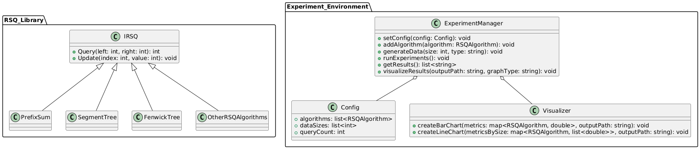

# Структура проекта и основные компоненты

## 1. Структура проекта

```cpp
/rsq_library              # Модуль с алгоритмами RSQ (header-only)
  /include                # Заголовочные файлы с реализациями алгоритмов
  /tests                  # Unit-тесты для проверки алгоритмов
    /include              # Header-файлы для unit-тестов

/experiment_environment   # Модуль экспериментальной среды
  /include                # Заголовочные файлы для экспериментальной среды
  /src                    # Исходный код для экспериментальной среды
  /data                   # Пример входных данных для тестирования
  /results                # Результаты тестов и сравнений

/docs                     # Документация
```

### Краткое описание классов проекта



#### 1. Модуль с алгоритмами RSQ

Этот модуль предоставляет **header-only библиотеку**, содержащую реализации структур данных для операций суммирования на отрезке (RSQ).

- **Класс `IRSQ`**: Базовый интерфейс для всех алгоритмов RSQ. Определяет стандартные методы `Query` и `Update`.
- **Реализации классов**: Каждая структура данных (например, FenwickTree, SegmentTree, PrefixSum) реализует интерфейс `IRSQ` и предоставляет свою версию методов.
- **Класс `ITestRSQ`**: Обеспечивает юнит-тестирование реализаций. Включает тесты на корректность выполнения операций `Query` и `Update`.

#### 2. Модуль экспериментальной среды

Этот модуль отвечает за проведение и управление экспериментами, измерение производительности и визуализацию результатов.

##### 1. Конфигурация экспериментов

- **Структура `Config`**: Содержит параметры конфигурации для экспериментов: выбор алгоритмов, размеры данных и количество запросов.

##### 2. Менеджер экспериментов

- **Класс `ExperimentManager`**: Основной класс для управления экспериментами. Реализует:
  - Настройку конфигурации экспериментов.
  - Генерацию входных данных (случайных или пользовательских).
  - Проведение тестов и бенчмаркинга.
  - Сохранение и отображение результатов.

##### 3. Модуль визуализации

- **Класс `Visualizer`**: Реализует построение графиков производительности.
  - Метод `createBarChart` строит гистограммы для сравнения метрик (например, времени работы алгоритмов).
  - Метод `createLineChart` строит линейные графики, отображающие зависимость производительности от размера данных.

## 2.Основные компоненты проекта

### 1. Алгоритмы RSQ (header-only библиотека)

Реализует 8 структур данных для RSQ. Каждый алгоритм представлен отдельным классом, реализующим базовый интерфейс для унификации работы. Также в этом модуле находятся юнит-тесты для проверки правильности работы алгоритмов.

* Базовый интерфейс

```cpp
struct IRSQ {
  virtual int Query(std::size_t left, std::size_t right) = 0;
  virtual void Update(std::size_t index, int new_value) = 0;
  virtual ~IRSQ() = default;
};
```

* Юнит-тесты

```cpp
class ITestRSQ {
public:
  void TestQuery() {
    // тестирование метода Query
  }
  void TestUpdate() {
    // тестирование метода Update
  }
};
```

### 2. Экспериментальная среда

#### 1. Конфигурация экспериментов

Конфигурация эксперимента задается через конфиг-файл, загружается с помощью класса ConfigLoader.

```cpp
class ConfigLoader {
public:
    // Возвращает исследуемые размеры входных данных
    static std::vector<int> loadConfig(const std::string &filename);
};
```

#### 2. Менеджер экспериментов

Реализован базовый класс - менеджер экспериментов. Его наследники - конкретные имплементации, которые управляет всеми этапами эксперимента и используют конкретную систему бенчмаркинга.

Менеджер эксперимент должен:

* Генерировать данные в зависимости от конфигурации.
* Проводить измерение времени работы и количества памяти через Benchmark.
* Выводить результаты на экран.

```cpp
class ExperimentManagerBase {
private:
    // Тестируем работу на заранее опреденных данных
    template <typename RSQType>
    static void MakeNaiveActions(std::size_t size);

    // Тестируем работу на случайных данных
    template <typename RSQType>
    static void MakeRandomActions(std::size_t size);

    // Тестируем работу на случайных параметризованных данных
    template <typename RSQType>
    static void MakeBenchmarkRandomParameterizedTest(
        std::size_t size,
        int min_element,
        int max_element,
        double update_probability
    )
    
    // И другие эксперименты
public:
    // Конструктор, принимающий исследуемые размеры массивов
    explicit ExperimentManagerBase(std::vector<int> sizes);

    // Запуск экспериментов
    void runExperiments();
};
```

#### 3. Модуль визуализации

Визуализация реализуется в отдельном классе, который включён в менеджер. Примерная структура класса, детали могут меняться

```cpp
class Visualizer {
public:
    // Построение гистограммы
    void createBarChart(const std::unordered_map<RSQAlgorithm, double>& performanceMetrics, 
                        const std::string& outputPath);

    // Построение линейного графика
    void createLineChart(const std::unordered_map<RSQAlgorithm, std::vector<double>>& performanceMetricsBySize, 
                         const std::string& outputPath);
};
```
