# Отчёт по сравнению алгоритмов

## Экспериментальная установка

Экспериментальная установка состоит из двух бенчмарков, которые запускают одинаковые наборы инструкций/тестовых
сценариев и считают их время работы. Каждый сценарий поддерживает работу на массивом размера `n`, что позволит построить
график времени работы методов от размера массива. Для запуска используется Docker.

Тестовые сценарии для постройки графиков:

* I: `n` последовательных пар операций Query и Update. Update в каждой ячейке массива. Query по всему массиву
* II: `n` последовательных пар операций Query и Update со случайными входными параметрами
* III: 99% Query и 1% Update в случайном порядке. Всего `2n` операций со случайными входными параметрами
* IV: 1% Query и 99% Update в случайном порядке. Всего `2n` операций со случайными входными параметрами
* V: Вызов конструктора

### Google Benchmark

Для запуска используется одноимённая библиотека

### Собственный бенчмарк

Самописный бенчмарк в основе которого подсчёт времени работы функции с использованием `std::chrono`

## Тестируемые алгоритмы

### Дерево отрезков, реализация сверху

* Построение: $\mathcal{O}(n)$
* Запрос суммы: $\mathcal{O}(\log n)$
* Запрос присваивания: $\mathcal{O}(\log n)$

### Дерево отрезков, реализация снизу

* Построение: $\mathcal{O}(n)$
* Запрос суммы: $\mathcal{O}(\log(r - l + 1))$
* Запрос присваивания: $\mathcal{O}(\log n)$

### Дерево Фенвика

* Построение: $\mathcal{O}(n)$
* Запрос суммы: $\mathcal{O}(r - l + 1)$
* Запрос присваивания: $\mathcal{O}(1)$

### Корневая декомпозиция

* Построение: $\mathcal{O}(n)$
* Запрос суммы: $\mathcal{O}(\sqrt{n})$
* Запрос присваивания: $\mathcal{O}(1)$

### Декартово дерево

* Построение: $\mathcal{O}(n \log n)$
* Запрос суммы: $\mathcal{O}(\log n)$
* Запрос присваивания: $\mathcal{O}(\log n)$

## Результаты

### I

**Наивная имплементация на Linux**  
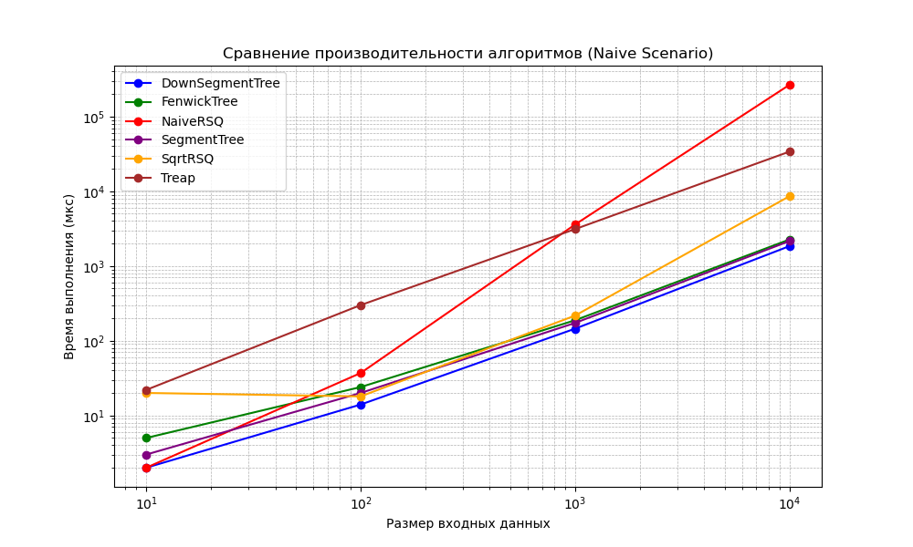

**Наивная имплементация на Mac**  
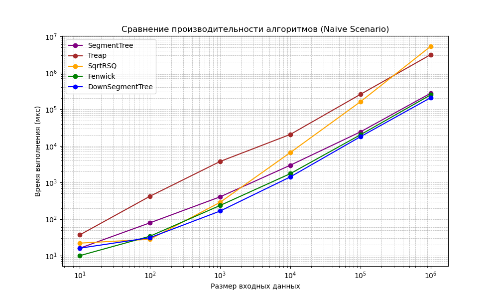

**Наивная имплементация на Windows**  
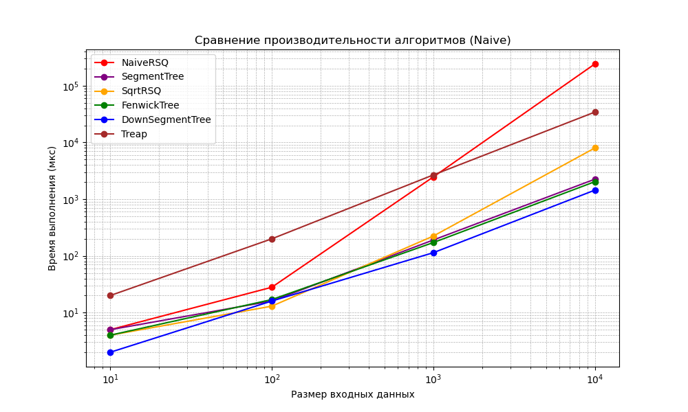

**Вывод:** график показывает, что наивная имплементация прогрывает при большом числе операций, однако выигрывает при
числе операций меньшем 30, так как не требует дополнительных ресурсов на построение структуры. Также решениям
значительно уступает корневая оптимизация. Наиболее эффективна реализация дерева отрезков снизу.

### II

**Рандомизированная имплементация на Linux**  
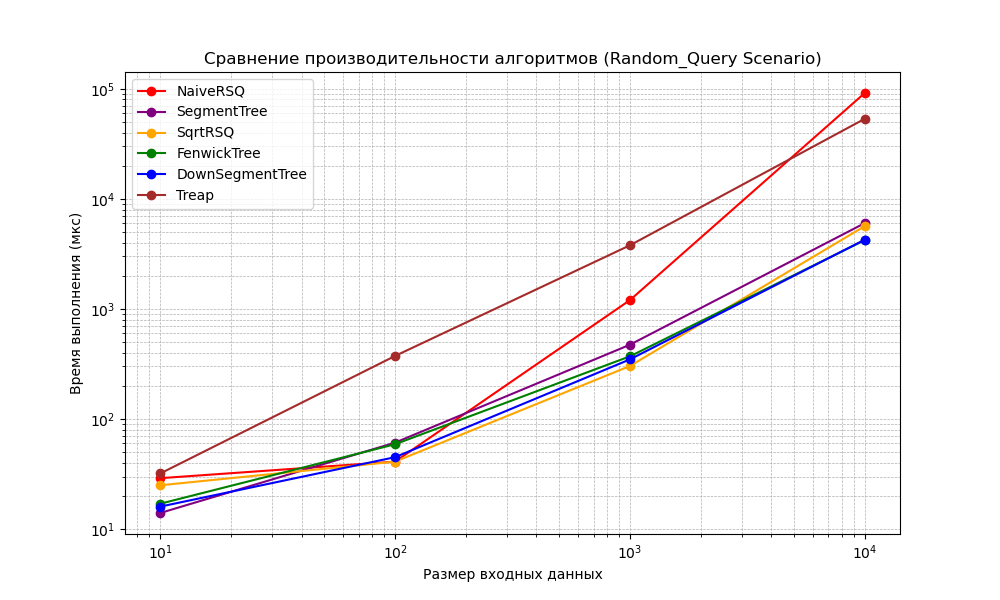

**Рандомизированная имплементация на Mac**  
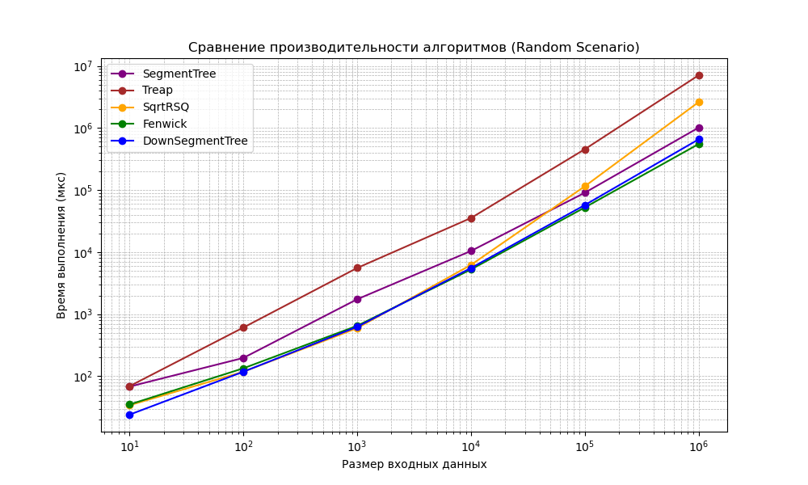

**Рандомизированная имплементация на Windows**  
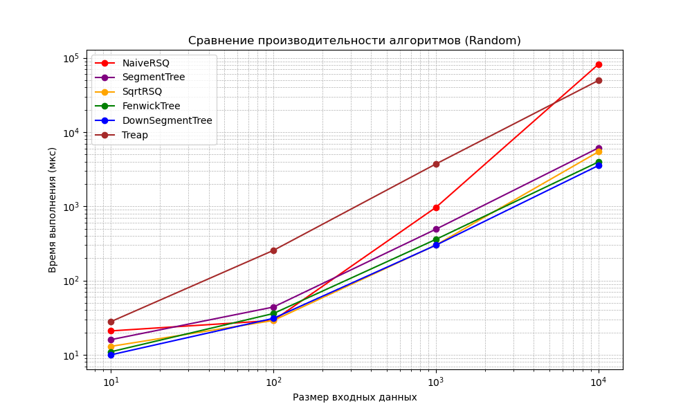

**Вывод:** наиболее оптимальны решения задачи RSQ деревом Фенвика и деревом отрезков снизу.

### III

**Рандомизированные обновления на Linux**  
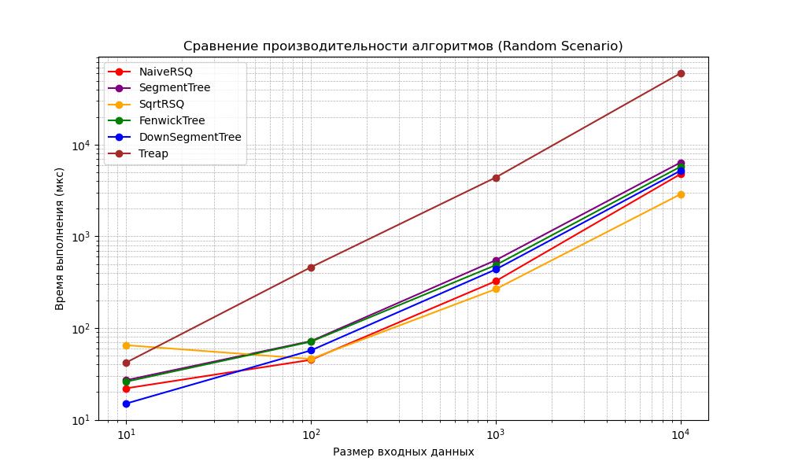

**Рандомизированные обновления на Mac**  
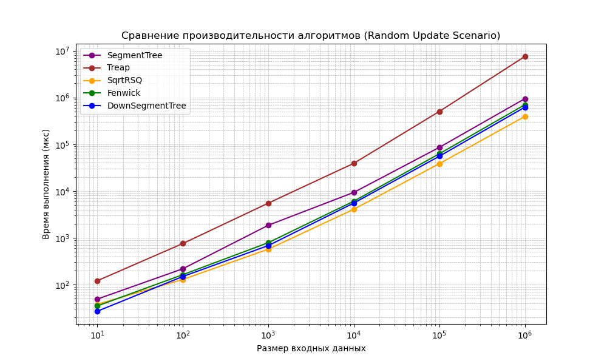

**Рандомизированные обновления на Windows**  
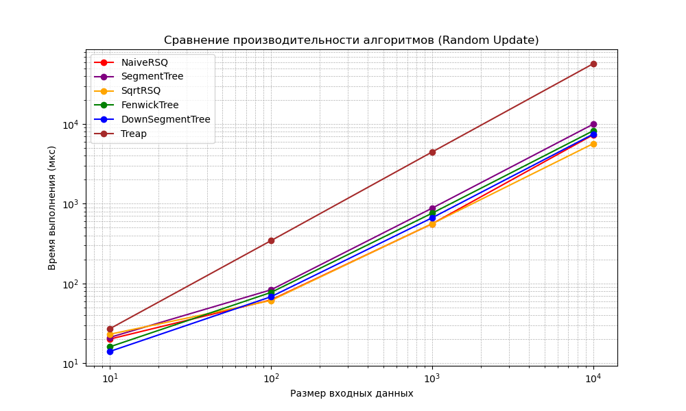

**Вывод:** наиболее оптимальна при большом количестве запросов Update реализация, использующая корневую оптимизацию.

### IV

**Рандомизированные запросы на Linux**  
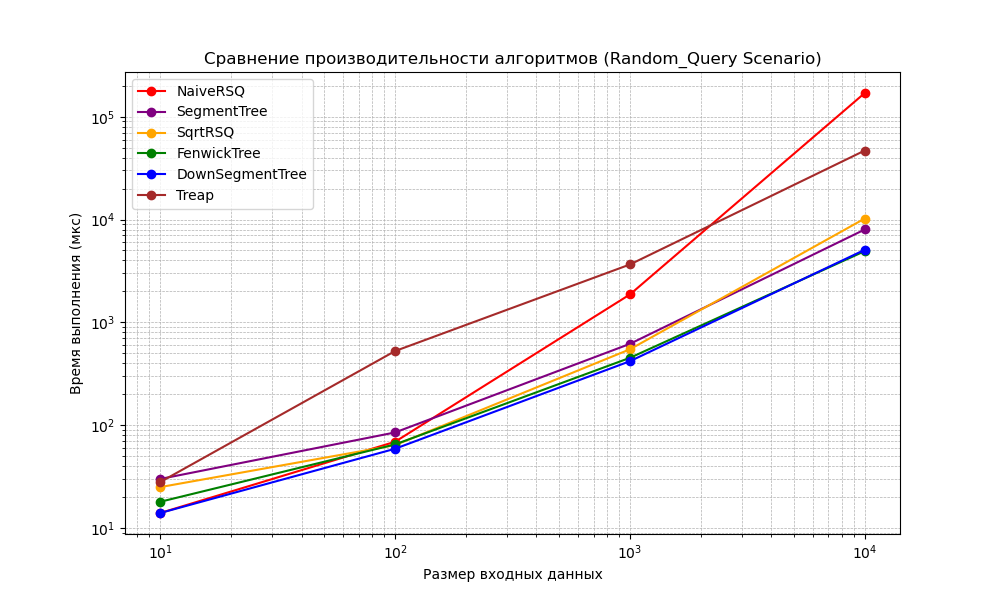

**Рандомизированные запросы на Mac**  
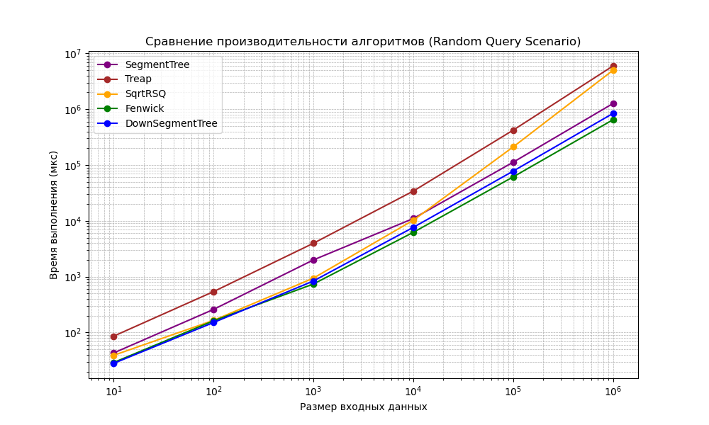

**Рандомизированные запросы на Windows**  
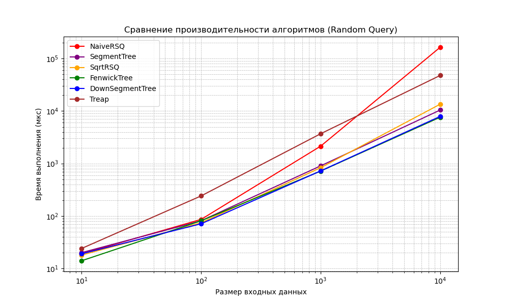

**Вывод:** при большом количестве операций получения суммы на отрезке оптимальнее использовать дерево Фенвика или дерево
отрезков снизу.

### V

**Конструктор на Linux**  
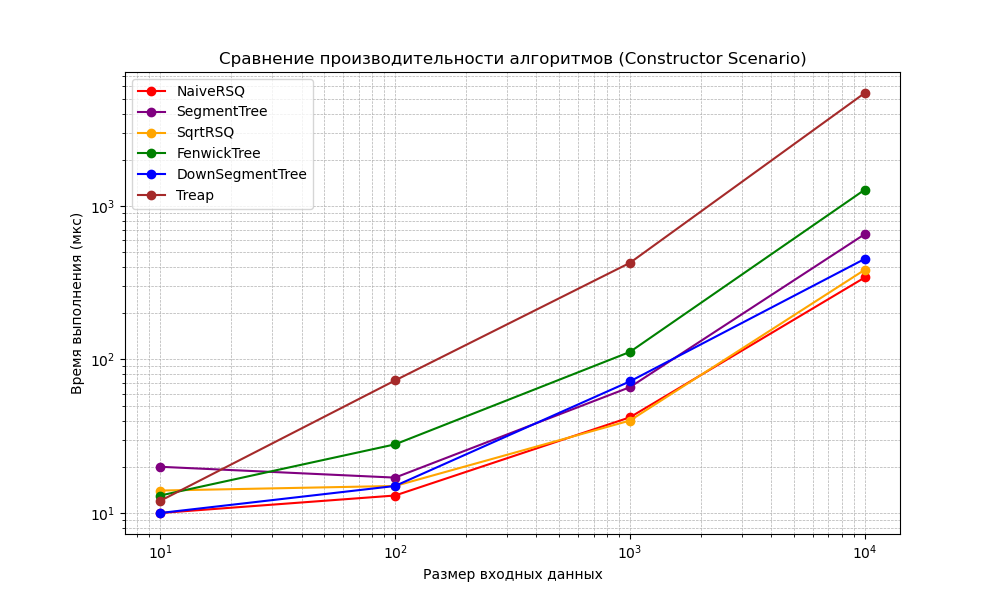

**Конструктор на Windows**  
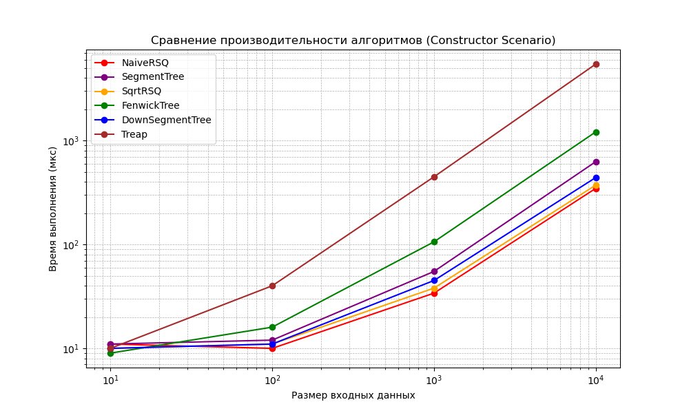

**Вывод:** самый быстрый конструктор у наивного алгоритма, и корневой декомпозиции, чуть больше времени занимают
построение деревьев, и самый долгий у **treap**.

## Выводы

Наиболее универсальными и оптимальными являются решения, использующие дерево отрезков снизу или дерево Фенвика. Обе
структуры строятся за $\mathcal{O}(n)$ и отвечают на запросы за $\mathcal{O}(\log n)$ с хорошей константой.

Однако если известно, что подавляющее большинство запросов — запросы изменения элементов, то эффективнее использовать
корневую оптимизацию, так как она отвечает на запрос изменения элемента за $\mathcal{O}(1)$, а на более редкие запросы
суммы на отрезке за $\mathcal{O}(\sqrt{n})$.

Хуже всего на пратике оказалсяа алгоритм, использующий декартово дерево, почти на всех значениях он показывает себя даже
хуже, чем наивная имплементация.

## Оценка памяти

Для оценки потребления памяти использовался инструмент Massif из набора Valgrind. Massif позволяет отслеживать выделение
и освобождение памяти в процессе выполнения программы, а также строить подробные отчеты о пиках использования памяти.

### Анализ пиков потребления памяти

В ходе выполнения эксперимента были зафиксированы несколько значительных пиков выделения памяти:

#### Первый значительный пик (~474 KB)

- Произошел на **snapshot 53**.
- Основное выделение связано
  с `rsq::benchmark::ExperimentManagerBase::MakeNaiveActions<rsq::SegmentTree>(unsigned long)` (*
  *experiment_manager_base.hpp:15**).
- Вызвано созданием вектора для хранения данных перед запуском эксперимента.
- **Алгоритм**: `SegmentTree`
- **Сценарий**: 1) Naive

#### Максимальный пик (~2 MB)

- Зафиксирован на **snapshot 55**.
- Основной объем памяти (около **2 MB**) используется для
  работы `rsq::SegmentTree::SegmentTree(std::vector<int> const&)` (**segment_tree.hpp:87**), что указывает на выделение
  памяти для структуры данных перед началом измерений.
- **Алгоритм**: `SegmentTree`
- **Сценарий**: 1) Naive

#### Второй значительный пик (~2 MB)

- Произошел на **snapshot 65**.
- Причина аналогична предыдущему случаю — массив `std::vector<int>` при создании `rsq::SegmentTree`.
- **Алгоритм**: `SegmentTree`
- **Сценарий**: 3) Random_Update

#### Заключительный пик (~874 KB)

- Зафиксирован на **snapshot 76**.
- Связан с выделением памяти в `rsq::benchmark::ExperimentManagerBase::MakeNaiveActions<rsq::NaiveRSQ>` (*
  *experiment_manager_base.hpp:15**).
- **Алгоритм**: `NaiveRSQ`
- **Сценарий**: 3) Naive

### Выводы

- **Наибольшее потребление памяти** продемонстрировал **SegmentTree**, что связано с его структурой хранения и
  выделением памяти под векторы.
- **Максимальный пик памяти (2 MB)** наблюдался при инициализации `SegmentTree`, что подтверждает его высокие затраты на
  создание структуры данных.
- **Алгоритм `NaiveRSQ`** потребляет значительно меньше памяти, но при этом менее эффективен с точки зрения времени
  выполнения.
- **Сценарий `Naive`** приводит к пикам памяти из-за необходимости хранения всех данных в массиве.
- **Сценарий `Random_Update`** также показал высокий расход памяти, что объясняется частыми изменениями данных
  в `SegmentTree`.
- Алгоритмы, не представленные в тексте, вероятно, не создают значительных пиков в использовании памяти, так как они
  не требуют больших выделений памяти или используют более эффективные структуры данных.


Оценка памяти проводилась на: 
```
Операционная система и архитектура:
Linux tanya-Vivobook-ASUSLaptop-M3401QA-M3401QA 6.8.0-52-generic #53~22.04.1-Ubuntu SMP PREEMPT_DYNAMIC x86_64 x86_64 x86_64 GNU/Linux

Процессор:
Architecture:                         x86_64
CPU op-mode(s):                       32-bit, 64-bit
Address sizes:                        48 bits physical, 48 bits virtual
Byte Order:                           Little Endian
CPU(s):                               12
On-line CPU(s) list:                  0-11
Vendor ID:                            AuthenticAMD
Model name:                           AMD Ryzen 5 5600H with Radeon Graphics
CPU family:                           25
Model:                                80
Thread(s) per core:                   2
Core(s) per socket:                   6
Socket(s):                            1
Stepping:                             0
CPU max MHz:                          4280,0000
CPU min MHz:                          400,0000
BogoMIPS:                             6587.99
Flags:                                fpu vme de pse tsc msr pae mce cx8 apic sep mtrr pge mca cmov pat pse36 clflush mmx fxsr sse sse2 ht syscall nx mmxext fxsr_opt pdpe1gb rdtscp lm constant_tsc rep_good nopl nonstop_tsc cpuid extd_apicid aperfmperf rapl pni pclmulqdq monitor ssse3 fma cx16 sse4_1 sse4_2 movbe popcnt aes xsave avx f16c rdrand lahf_lm cmp_legacy svm extapic cr8_legacy abm sse4a misalignsse 3dnowprefetch osvw ibs skinit wdt tce topoext perfctr_core perfctr_nb bpext perfctr_llc mwaitx cpb cat_l3 cdp_l3 hw_pstate ssbd mba ibrs ibpb stibp vmmcall fsgsbase bmi1 avx2 smep bmi2 erms invpcid cqm rdt_a rdseed adx smap clflushopt clwb sha_ni xsaveopt xsavec xgetbv1 xsaves cqm_llc cqm_occup_llc cqm_mbm_total cqm_mbm_local user_shstk clzero irperf xsaveerptr rdpru wbnoinvd cppc arat npt lbrv svm_lock nrip_save tsc_scale vmcb_clean flushbyasid decodeassists pausefilter pfthreshold avic v_vmsave_vmload vgif v_spec_ctrl umip pku ospke vaes vpclmulqdq rdpid overflow_recov succor smca fsrm debug_swap
Virtualization:                       AMD-V
L1d cache:                            192 KiB (6 instances)
L1i cache:                            192 KiB (6 instances)
L2 cache:                             3 MiB (6 instances)
L3 cache:                             16 MiB (1 instance)
NUMA node(s):                         1
NUMA node0 CPU(s):                    0-11


Объем оперативной памяти:
               total        used        free      shared  buff/cache   available
Mem:            15Gi       6,6Gi       2,3Gi       369Mi       6,2Gi       7,7Gi
Swap:          2,0Gi          0B       2,0Gi
```
