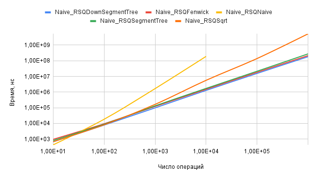
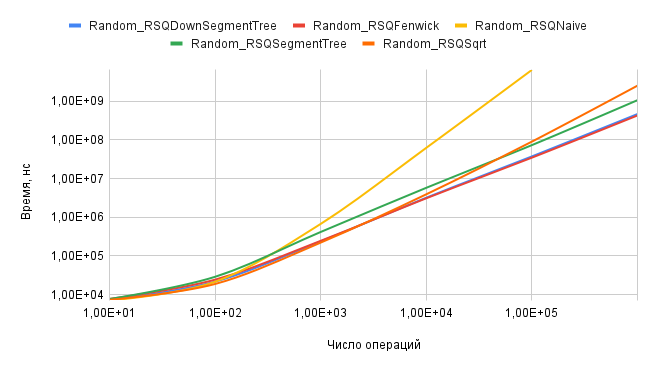
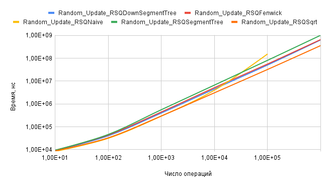
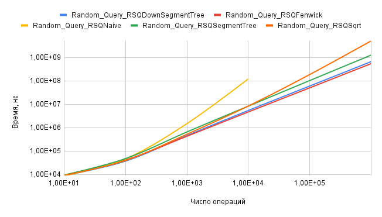

# Отчёт по сравнению алгоритмов
## Экспериментальная установка
Экспериментальная установка состоит из двух бенчмарков, которые запускают одинаковые наборы инструкций/тестовых сценариев и считают их время работы. Каждый сценарий поддерживает работу на массивом размера `n`, что позволит построить график времени работы методов от размера массива. Для запуска используется Docker. 

Тестовые сценарии для постройки графиков:
* I: `n` последовательных пар операций Query и Update. Update в каждой ячейке массива. Query по всему массиву
* II: `n` последовательных пар операций Query и Update со случайными входными параметрами
* III: 99% Query и 1% Update в случайном порядке. Всего `2n` операций со случайными входными параметрами
* IV: 1% Query и 99% Update в случайном порядке.  Всего `2n` операций со случайными входными параметрами

### Google Benchmark
Для запуска используется одноимённая библиотека 
### Собственный бенчмарк
Самописный бенчмарк в основе которого подсчёт времени работы функции с использованием `std::chrono`
## Тестируемые алгоритмы 
### Дерево отрезков, реализация сверху
   * Построение: $\mathcal{O}(n)$
   * Запрос суммы: $\mathcal{O}(\log n)$
   * Запрос присваивания: $\mathcal{O}(\log n)$
### Дерево отрезков, реализация снизу
   * Построение: $\mathcal{O}(n)$
   * Запрос суммы: $\mathcal{O}(\log(r - l + 1))$
   * Запрос присваивания: $\mathcal{O}(\log n)$
### Дерево Фенвика
  * Построение: $\mathcal{O}(n)$
  * Запрос суммы: $\mathcal{O}(r - l + 1)$
  * Запрос присваивания: $\mathcal{O}(1)$
### Корневая декомпозиция
   * Построение: $\mathcal{O}(n)$
   * Запрос суммы: $\mathcal{O}(\sqrt{n})$
   * Запрос присваивания: $\mathcal{O}(1)$
### Декартово дерево
   * Построение: $\mathcal{O}(n \log n)$
   * Запрос суммы: $\mathcal{O}(\log n)$
   * Запрос присваивания: $\mathcal{O}(\log n)$

## Результаты 
### I 

Вывод: график показывает, что наивная имплементация прогрывает при числе большом числе операций, однако выигрывает при числе операций меньшем 30, так как не требует дополнительных ресурсов на построение структуры.

Также решениям значительно уступает корневая оптимизация. Наиболее эффективна реализация дерева отрезков снизу.

### II

Вывод: наиболее оптимальны решения задачи RSQ деревом Фенвика и деревом отрезков снизу.

### III

Вывод: наиболее оптимальна при большом количестве запросов Update реализация, использующая корневую оптимизацию.

### IV

Вывод: при большом количестве операций получения суммы на отрезке оптимальнее использовать дерево Фенвика или дерево отрезков снизу.

## Выводы 

Наиболее универсальными и оптимальными являются решения, использующие дерево отрезков снизу или дерево Фенвика. Обе структуры строятся за $\mathcal{O}(n)$ и отвечают на запросы за $\mathcal{O}(\log n)$ с хорошей константой.

Однако если известно, что подавляющее большинство запросов - запросы изменения элементов, то эффективнее использовать корневую оптимизацию, так как она отвечает на запрос изменения элемента за $\mathcal{O}(1)$, а на более редкие запросы суммы на отрезке за $\mathcal{O}(\sqrt{n})$.
